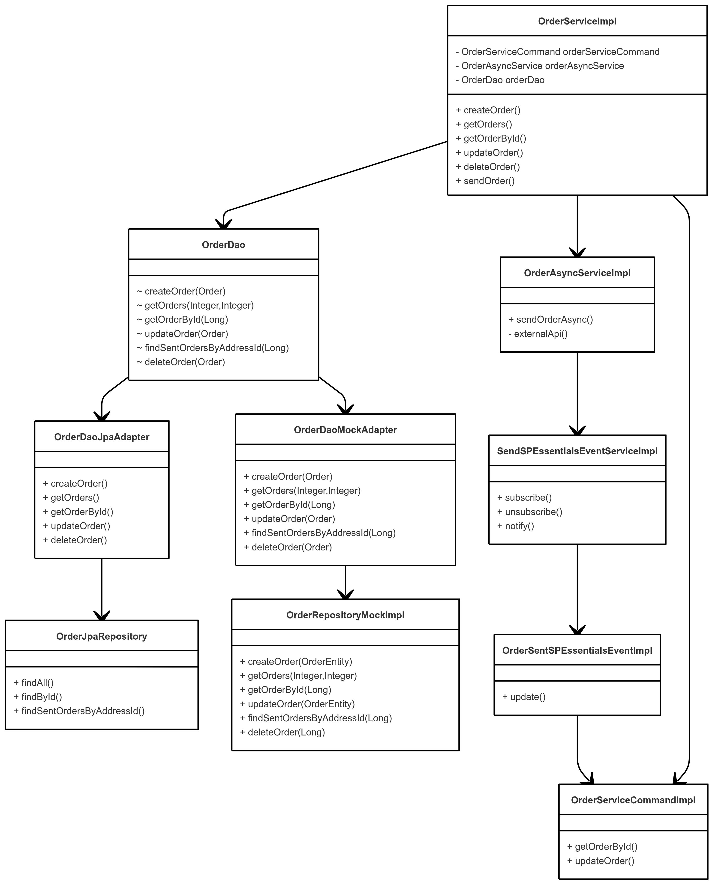

# Simple Order Manager Service

A hands-on way to dive into the Spring Boot Framework by building a basic Order Manager from scratch.

This service allows to create and retrieve orders while simulating real-world backend scenarios such as async processing, cache management, secured endpoints, form-based login, and clean architectural design.
It also showcases best practices and pattern designs like Factory, Strategy or Observer.

## 🎯 Main goals

* Build a RESTful API for managing orders and addresses
* Follow clean code principles and best practices as well as design patterns:
  * Hexagonal architecture (Domain → Application → Infrastructure)
  * Design Patterns:
    * Factory Pattern for centralized exception creation
    * Observer Pattern to simulate async behaviours
    * Strategy Pattern to initialize all the needed DB data
* Practice key Spring Boot concepts and logging:
  * Exception Handling
  * Spring security
  * JPA
  * Caching
  * Aspects (AOP)
  * Async
  * Actuator
  * Interceptors
  * Filters
  * Custom configuration
  * Logging with log4j2

## 🛠️ Tech Stack

* Spring Boot 3.4.3
* Java 23
* Maven
* Log4j2
* H2 (In-memory DB)

## 🏗️ Architecture Overview

The app follows Hexagonal Architecture (Ports & Adapters) to separate core domain logic from infrastructure::
  * Input Ports: REST Controllers expose use cases
  * Output Ports: Repositories abstract DB interactions
  * Adapters: Real DB implementation using Spring Data JPA and a mock repository

The OrderService is designed to handle order creation asynchronously using a custom AsyncService. 
When the processing completes, it uses the Observer Pattern to trigger updates on the original order — demonstrating 
non-blocking orchestration.
It also uses interface segregation in order to avoid circular dependencies. 
Check out the following diagram to see the flow!

## 🔐 Authentication & Security
This application uses Spring Security with form-based login for authentication. A custom security configuration overrides the default behavior to:
* Enable form-based login
* Allow unauthenticated access to specific endpoints
* Provide custom logic for creating new users at runtime for testing/demo purposes

## ⚙️ Async Service & Custom Thread Management
The AsyncService is configured with a custom thread pool executor and error handling mechanism:
* Custom ThreadPoolTaskExecutor:
  * Limited core/max thread count
  * Custom rejection policy to discard new tasks if the pool is full
* CustomAsyncExceptionHandler to capture and log uncaught exceptions from async tasks

## 🧠 DB Initialization

In order to be able to use the application correctly the project automatically insert some predefined data
in the DB such as Orders codes and a default admin user to log in the application.
To do so, a Strategy Pattern has been implemented to keep this process clean and extensible.

## 🚀 Getting Started
1. Download the project
2. In root folder execute mvn spring-boot:run
3. Get ready to play using the default user admin/admin